# А вы знаете, что такое Волжский Гедонизм? 

<table cellspacing="0">
   <tr>
    <td style="width: 600px;">
        <picture> 
        <source srcset="files/img_4721.jpeg">
        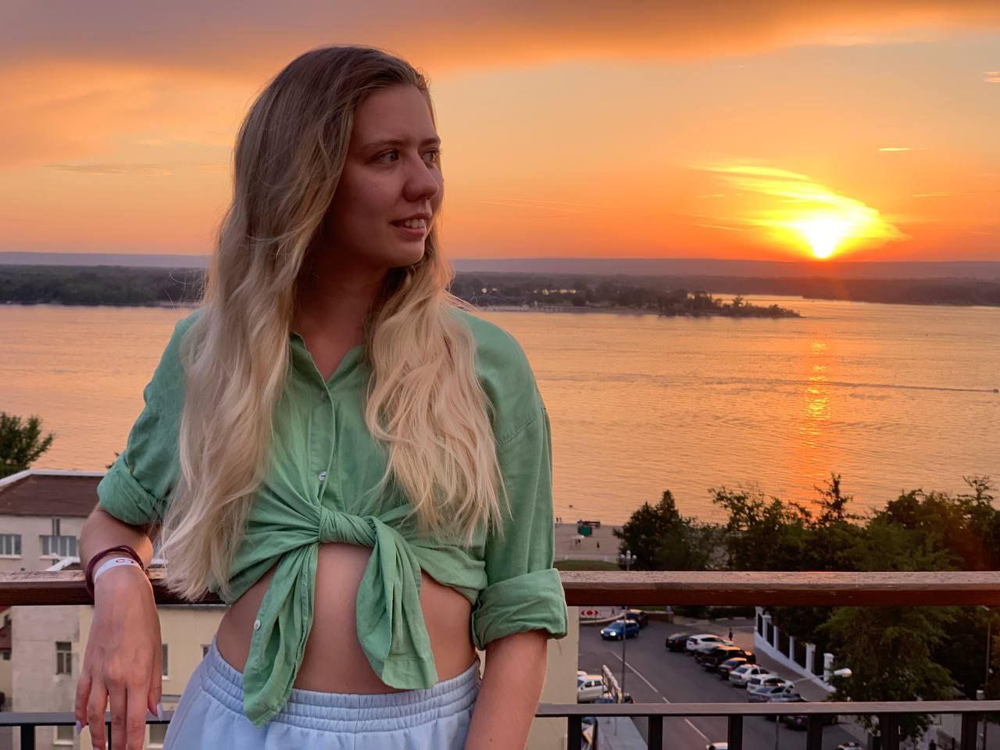
        </picture>
    </td>
    <td style="width: 400px;">
Привет! Меня зовут Маргарита, и я выросла в прекрасном городе Самаре. Хотя сейчас я живу в Москве, но моя душа остается в родных местах, особенно когда наступает лето. Именно в это время город оживает и наполянется особенной атмосферой расслабления и радости.

</td>
   </tr>
  </table>   
У каждого волжанина свое определение гедонизма: для одного - это вечерний променад по набережной, для другого - ходить босиком по песку в офисном костюме, а для третьего - это пиво за Волгой с друзьями. Я предлагаю вам найти свое определение волжского гедонизма!

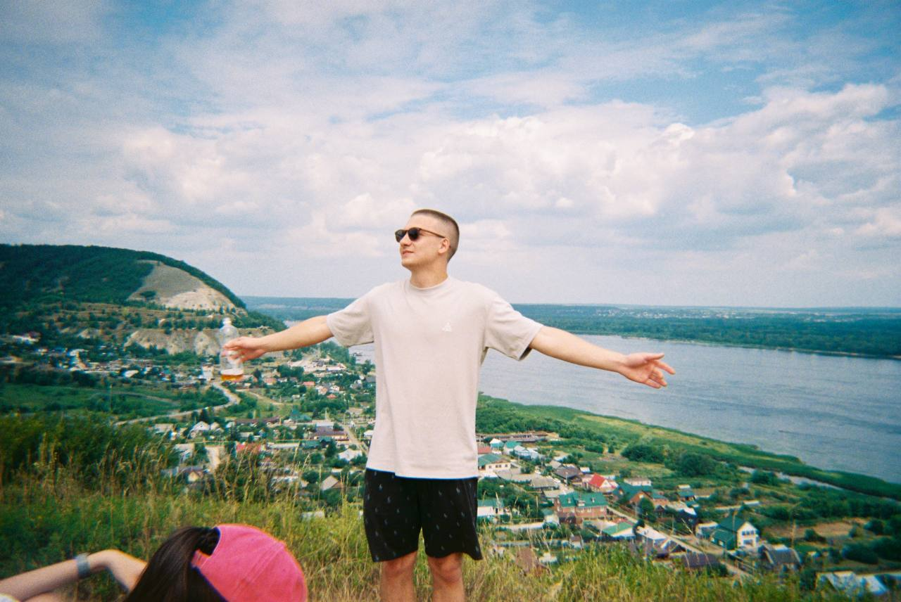  
   
Самара — это место, где каждое лето становится незабываемым. Здесь вы можете насладиться прогулками по историческому центру, посетить интересные музеи, отдохнуть на потрясающем пляже и наесться до отвала в местных ресторанах и барах. Всё это — в шаговой доступности. Также, вы можете устроить увлекательные поездки в национальный парк Самарская Лука всего в 7 минутах от центра.   
<table cellspacing="0">
   <tr>
    <td style="width: 500px;">
        <picture> 
        <source srcset="files/img_5324.jpeg">
        
        </picture>
                <picture> 
        <source srcset="files/img_7707.jpeg" >
        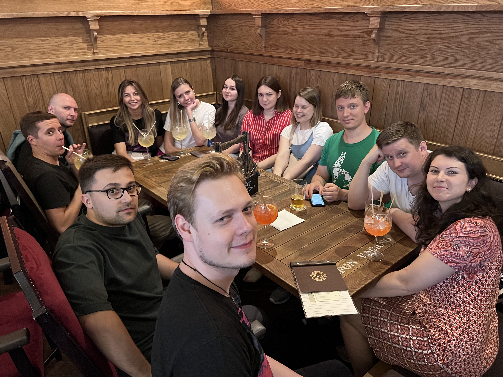
        </picture>
    </td>
    <td style="width: 500px;">
        <picture>
        <source srcset="files/img_7396.jpeg">
        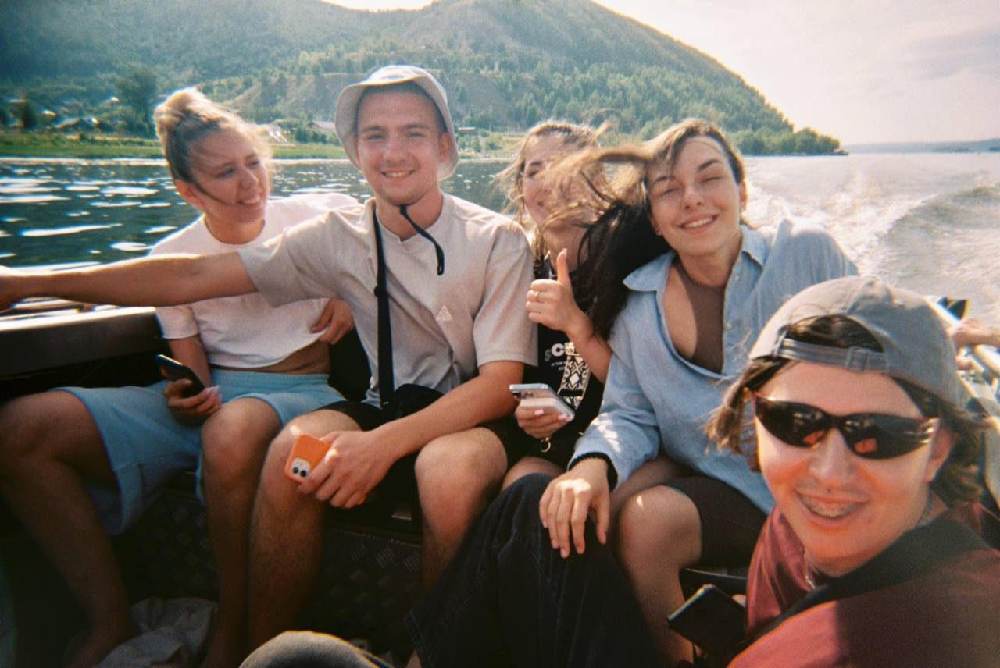
        </picture>
                <picture>
        <source srcset="files/img_7399.jpeg">
        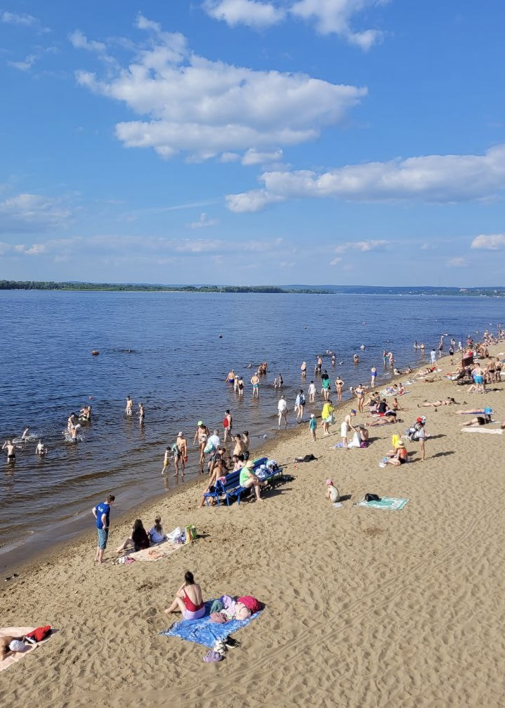
        </picture>
    </td>
   </tr>
  </table>

В течение нескольких лет я устраиваю поездки для друзей, которые хотят поработать удаленно из Самары и при этом наслаждаться духом Поволжья. За это время я подготовила гайды о том, что стоит сделать и где пообедать в моем любимом городе, сделала множество фотографий и собрала теплые отзывы.   
[Гайд по Самаре. Развлечения и досуг](gaid-po-samare-razvlecheniia-i-dosug.md)    
[Гайд по Самаре. Еда](gaid-po-samare-eda.md)    
<table cellspacing="0">
   <tr>
    <td style="width: 400px;">
        <picture> 
        <source srcset="files/img_2254.jpeg">
        
        </picture>
        
> "Незабываемый чилл на Волге"  

</td>
    <td style="width: 500px;">
        <picture>
        <source srcset="files/img_7394.jpeg">
        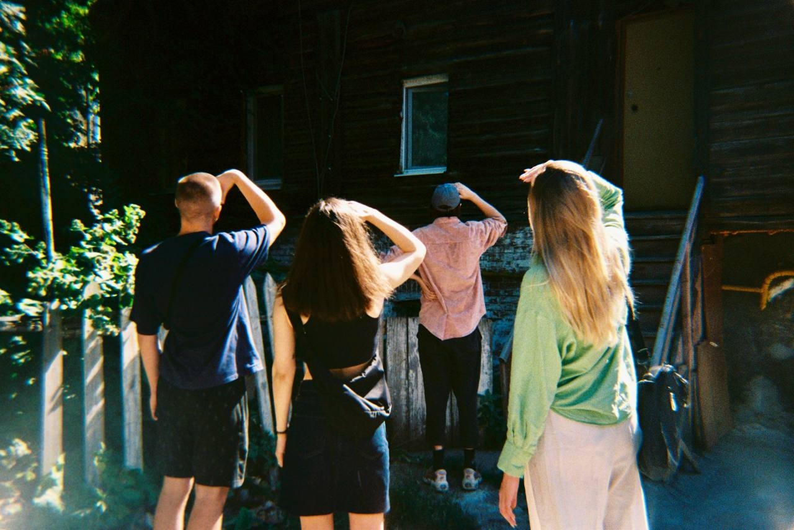
        </picture>
                <picture>
        <source srcset="files/img_7395.jpeg">
        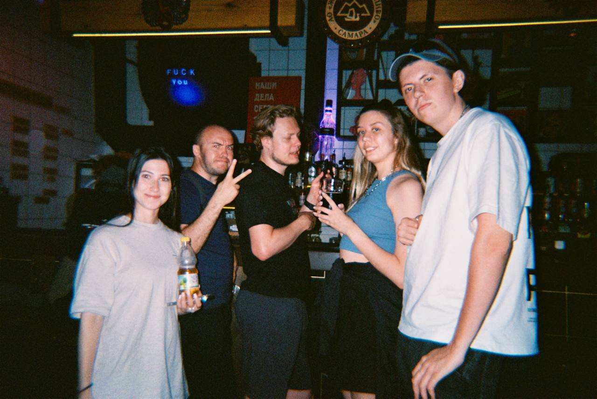
        </picture>
    </td>
   </tr>
  </table>

<table cellspacing="0">
   <tr>
    <td style="width: 500px;">
        <picture> 
        <source srcset="files/img_7405.jpeg">
        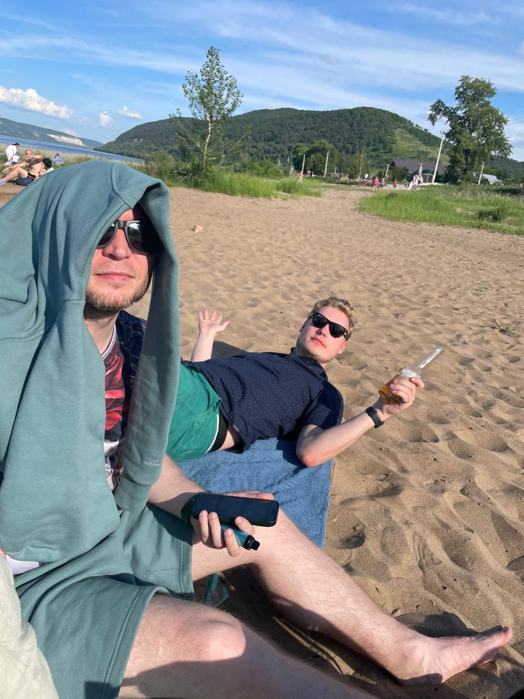
        </picture>
    </td>
    <td style="width: 500px;">
        <picture>
        <source srcset="files/img_7403.jpeg">
        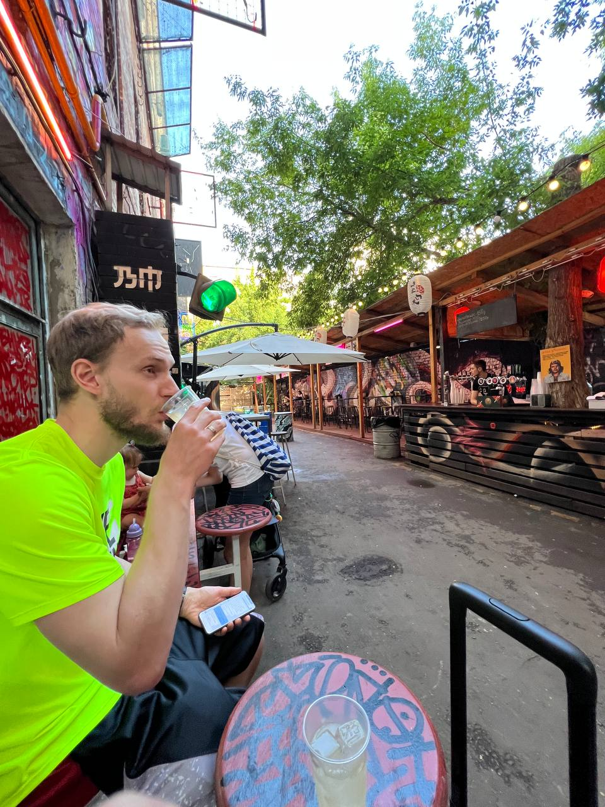
    </td>
   </tr>
  </table>

<table cellspacing="0">
   <tr>
    <td style="width: 600px;">
        <picture> 
        <source srcset="files/img_7397.jpeg">
        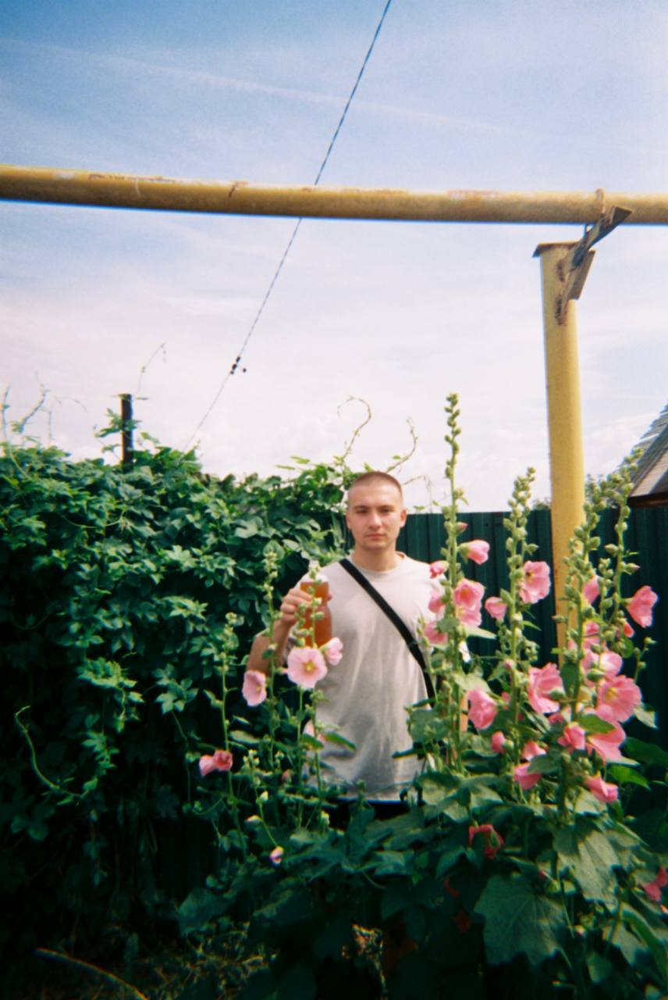
        </picture>
    </td>
    <td style="width: 400px;">

> Я с таким трепетом вспоминаю о Самаре, было так душевно и тепло, что мы недавно даже обсуждали с Сашей, что хочется вернуться   
> Мне, кажется, все было супер, был спорт: Вейки, сапы, экскурсии, совместные вылазки на завтраки и ужины + работа, может какие-то еще совместные активности, по типу квестов, но в целом, все было супер!  
    
 <picture>
        <source srcset="files/img_9893.jpeg">
        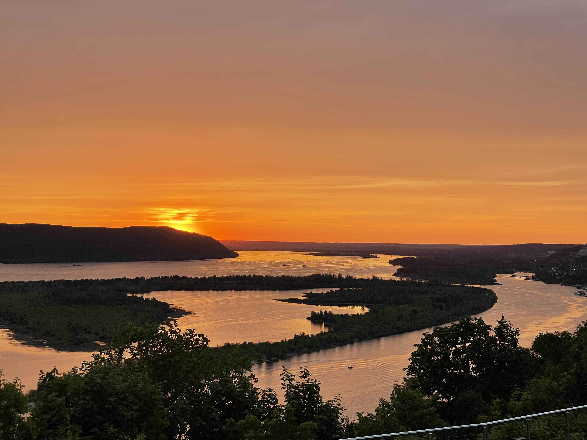
    </picture>
    </td>
   </tr>
  </table>

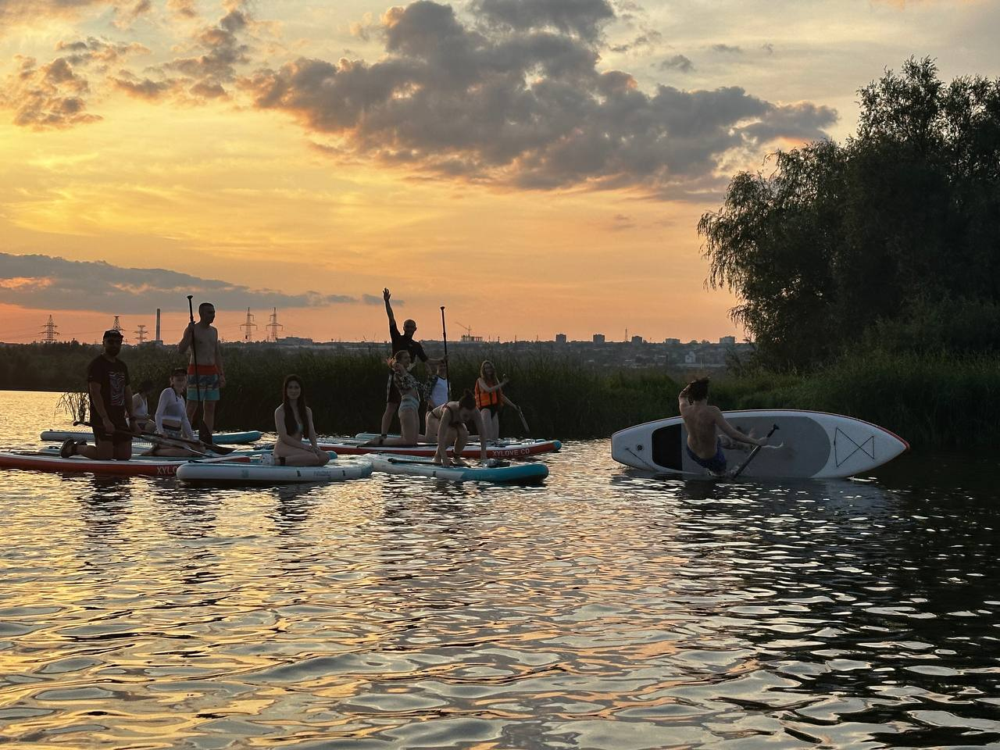   
  
<table cellspacing="0">
   <tr>
    <td style="width: 400px;">

> Иван настоятельно рекомендует!   

<picture> 
        <source srcset="files/img_7406.jpeg">
        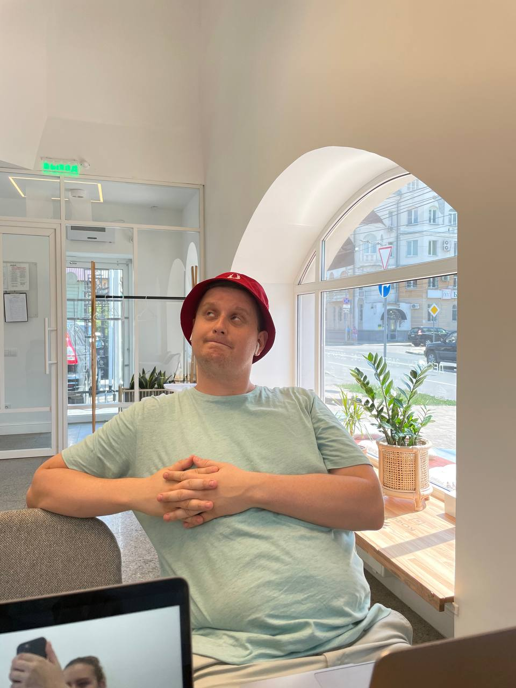
        </picture>
    </td>
    <td style="width: 600px;">
        <picture>
        <source srcset="files/img_7401.jpeg">
        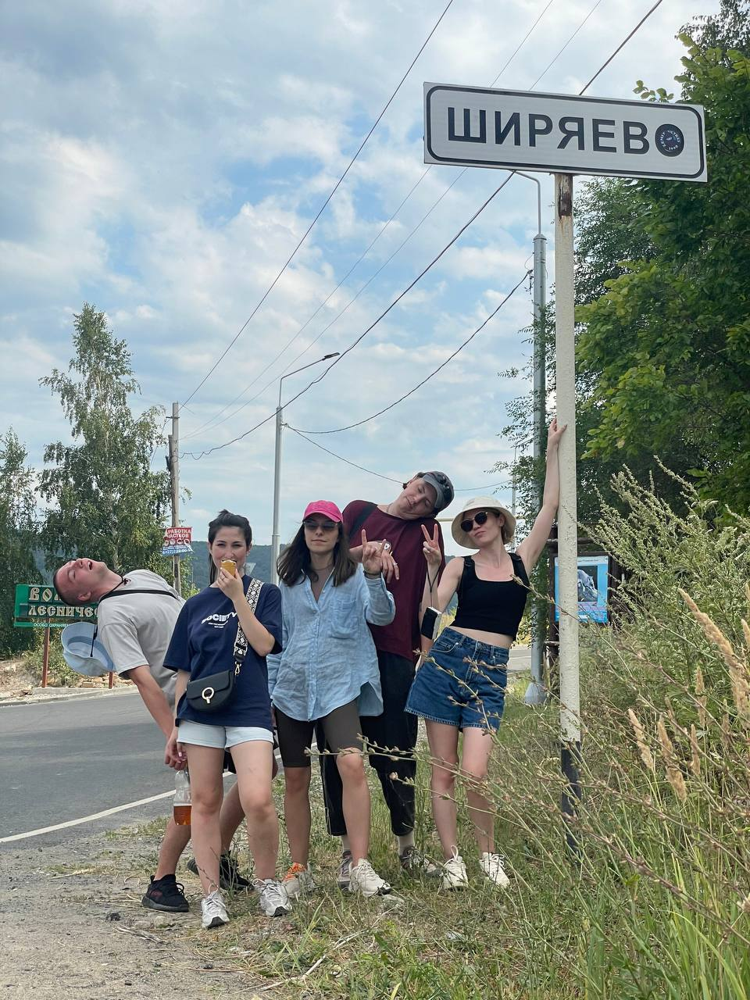
    </td>
   </tr>
  </table>

Сейчас я собираю новую группу для незабываемой поездки этим летом. Я прошу вас пройти небольшой опрос, чтобы узнать ваши предпочтения и выбрать оптимальные даты для нашего путешествия. Организация поездки требует немало усилий, поэтому я буду рада, если кто-то захочет помочь в к организации.   

**Заполните опрос и присоединяйтесь к нашему приключению!**   
[Выезд в Самару 2025](https://forms.gle/AYTrTM2Rwa3gm8ik8)    
### **Откройте для себя прелести Самары этим летом вместе с нами!**   

[Гайд по Самаре. Развлечения и досуг](gaid-po-samare-razvlecheniia-i-dosug.md)    
[Гайд по Самаре. Еда](gaid-po-samare-eda.md)    
Спасибо за материалы @valentinemm @DotTwelve @Lisa\_Sarycheva @arketson @lisknyazeva (telegram)    
   
