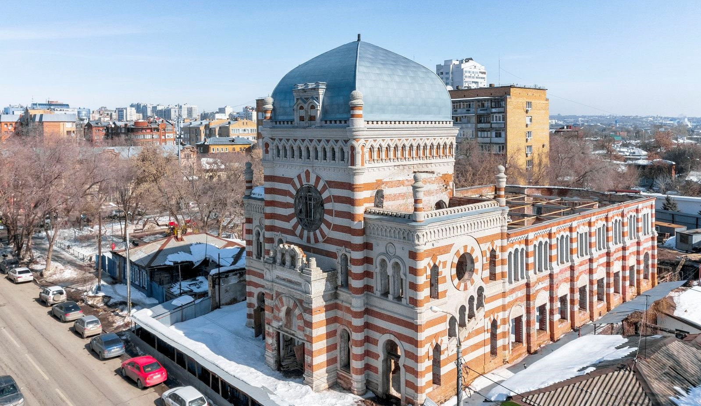
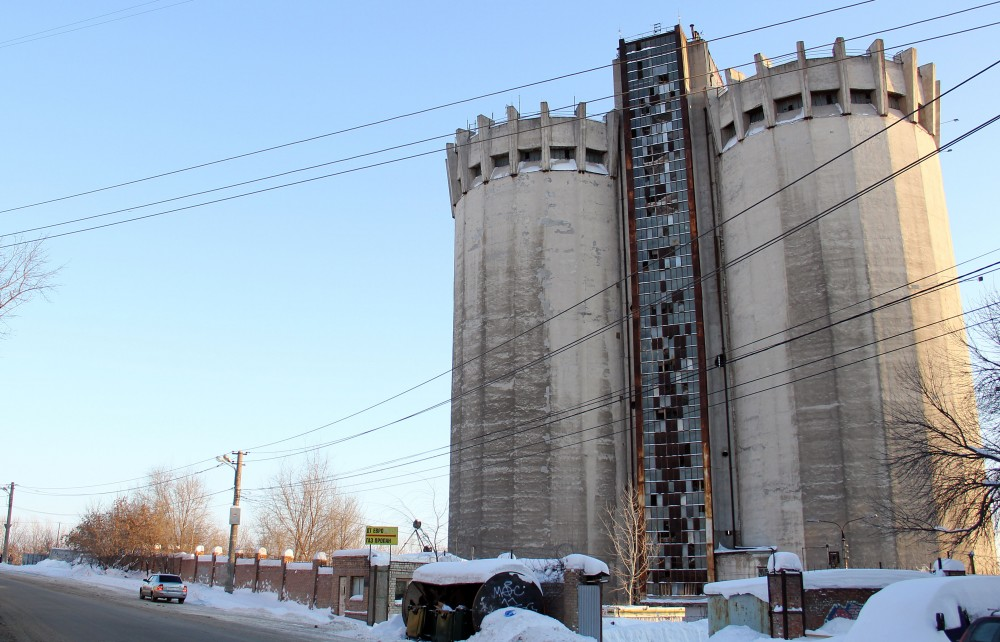
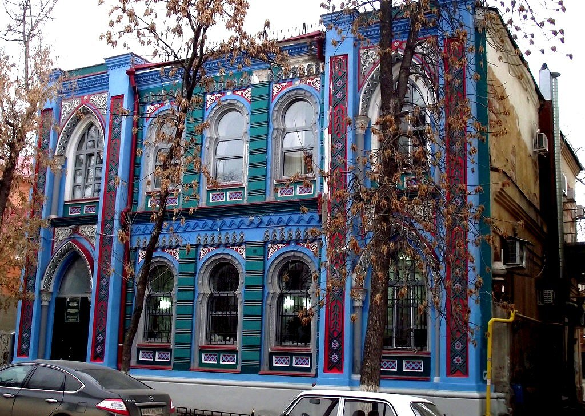
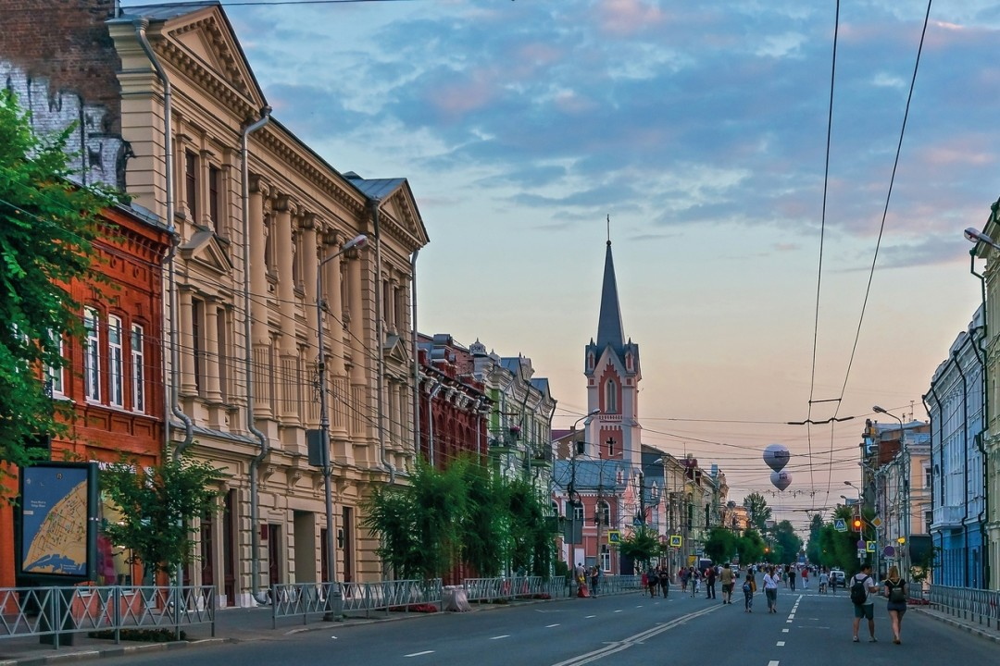
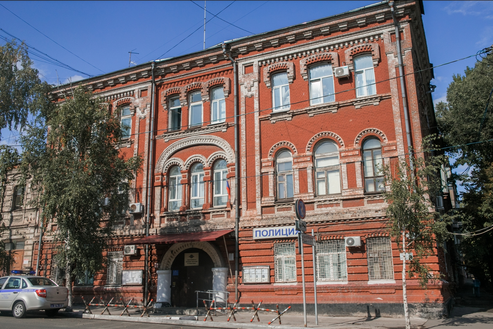
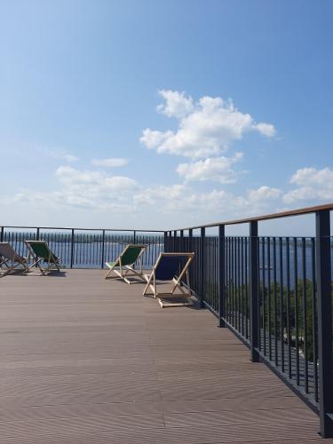
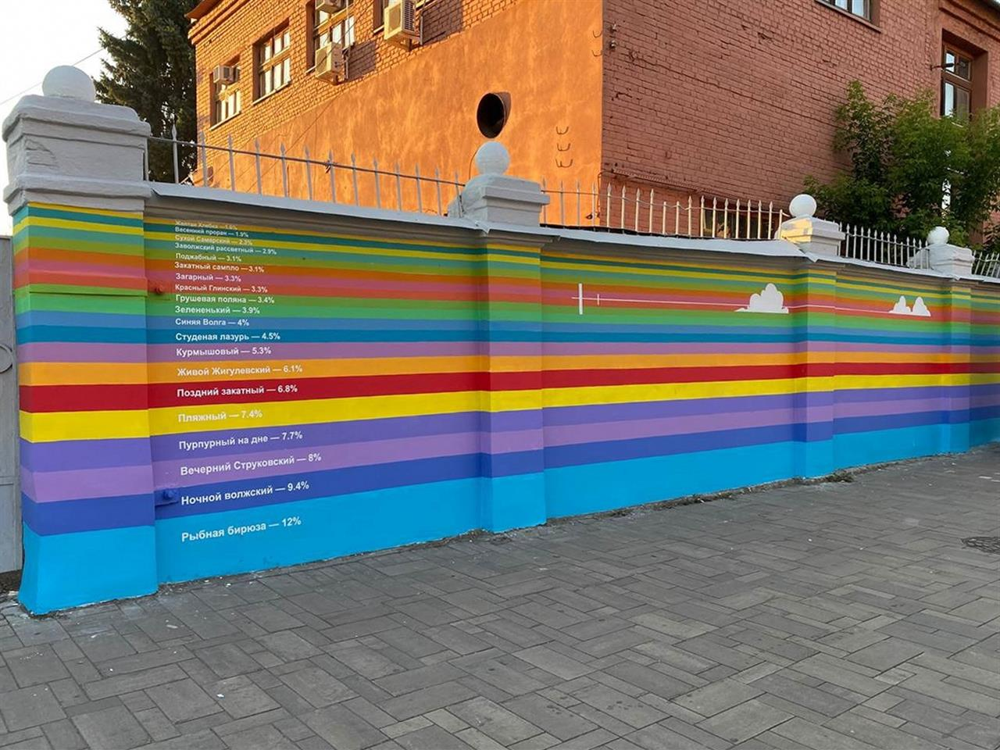
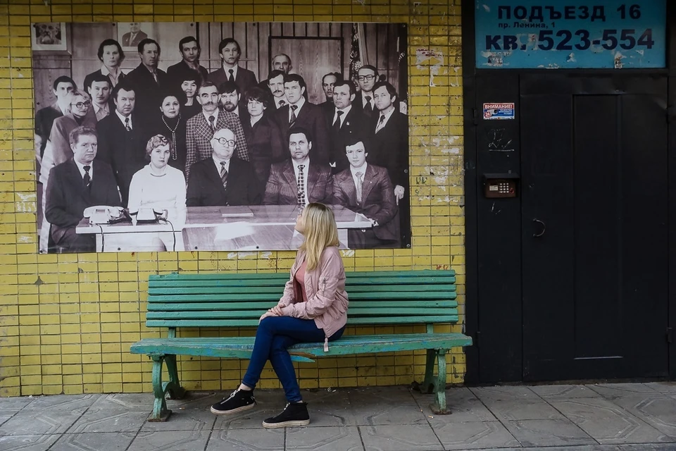
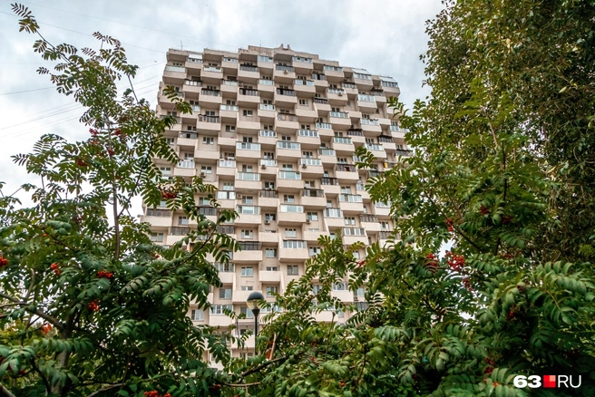
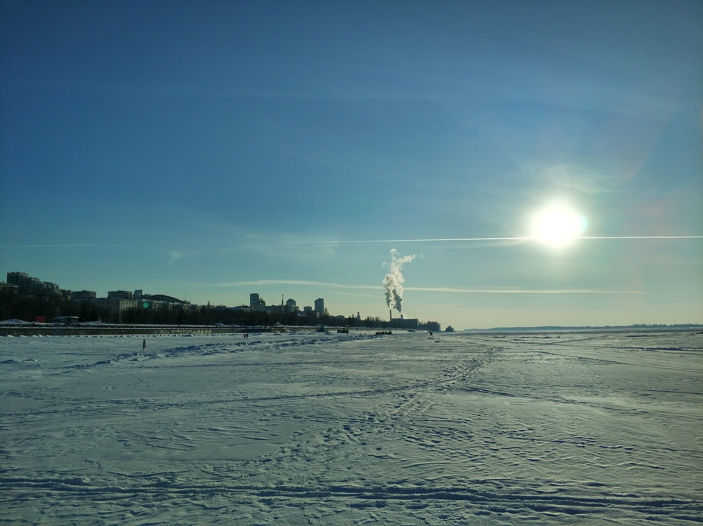

# Гайд по Самаре. Развлечения и досуг   
Привет! Если ты на этой странице, то возможно ищешь, чем бы себя развлечь в прекрасном городе-курорте Самаре. В городе много чудесных туристических мест, отраженные в путеводителях: набережная, площадь Славы, вертолетка и тд. Но они слабо отражают всю сложность и многообразие города. Потому и появился этот документ. Здесь собранны проверенные активности на любой вкус и цвет.   
# Культурная программа   
Раздел расскажет о том, где проводить осмотр достопримечательностей, в какие музеи сходить, на какие экскурсии записаться   
## Прогулки по городу   
В Самаре обширный исторический центр,  котором можно гулять довольно долго и встретить совершенно разные памятники архитектуры. Здесь я опишу локации, про которые обычно не пишут на [Трипадвайзере](https://www.tripadvisor.ru/Attractions-g298521-Activities-c47-Samara_Samara_Oblast_Volga_District.html) или [популярных гайдах](https://journal.tinkoff.ru/samara-one-day/)   
> Хоральная синагога в мавританском стиле   

Заброшенное, но очень красивое и уникальное здание со сложной судьбой. Подробнее можно почитать по [ссылке](https://komunavolge.ru/guides/architecture/sinagoga-na-sadovoy-neomavritanskiy-stil-v-tsentre-samary.html)   
    
Адрес: ул. Садовая, 49   
> Самарский элеватор   

Один из экспериментальных элеваторов конца прошлого века в стиле брутализм. Его история [описана тут](https://drugoigorod.ru/experimental_elevator/)   
    
[Адрес](https://yandex.ru/maps/-/CDSTu6-q), но лучше полюбоваться им с одного из мостов через р Самара   
### Кожвен диспансер или особняк Серебренниковой   
Еще один образец мавританского стиля. Об истории особняка [можно почитать тут](https://dzen.ru/a/Y4TAYBnvKUdeAya9)   
    
Степана Разина 41   
> Улица Куйбышева   

По личному мнению автора красивей, интересней и активней, чем улица Ленинградская. Гулять по ней гораздо приятнее и занимательнее. [Статья](https://drugoigorod.ru/kuybyshev_street/) об улице   
    
> Улица Молодогвардейская   

Одна из самых протяженных улиц старого центра. В начале это купеческая застройка, позже вбирающая в себя советские постройки, и вмещающя в себя даже Евроквартал. Путешествие сквозь эпохи. [Подробнее почитать](https://drugoigorod.ru/molodogvardeiskaya_street/) про историю улицы   
    
> Крыша Станкозавода   

Отличное место встретить закат на Волге. Вход платный, работает тоже непонятно по какому расписанию) Но оно того точно стоит. Рядом чудесный Струковский сад - старейший в городе парк   
    
улица Куйбышева, 128/1   
> Арт-проект Общее решение   

Когда-то в городе запустили голосование - в какой цвет покрасить забор ГРЭС. Вопрос стал холиварным и вызвал много шума. Но никому не рассказали о том, что забор покрасят во все цвета, представленные в голосовании) Полезный урок нам всем. [Подробнее](https://volga.news/article/583272.html)   
    
    
> Козловский дом   

Один из самых длинных домов в Самаре. Строился по инициативе директора ЦСКБ Прогресс и с его личным вмешательством в процесс проектирования, отчего имеет много особенностей и интересных жителей. [Почитать тут](https://www.samara.kp.ru/daily/26965/4020627/)   
    
Проспект Ленина 1   
> Дом-терка   

Смешная и интересная многоэтажка. [История у нее небольшая](https://progorodsamara.ru/news/view/istoria-samary-v-zdaniah-pocemu-dom-na-osipenko-nazyvaut-kukuruzoj-i-scitaut-strasnym)   
    
Осипенко 32   
> Зимняя опция +   

Кутайтесь потеплее! Вы будете переходить Волгу! Дойдите до Прорана. Погуляйте по белоснежной пустыне реки, пока она скована льдом. Если боитесь провалится под лед, то проверьте - открыли ли зимник. Если автомобильная переправа работает, то вас лед выдержит точно)   
    
    
## Музеи   
**Самарский художественный музей**   
Картинная галерея. По сути - хранит в себе коллекцию семьи [местной династии Шихобаловых](https://sgpress.ru/news/430935). Все филиалы музея находятся в шикарных особняках в историческом центре.   
[Самарский областной художественный музей \- Главная](https://artmus.ru/)    
**Галерея Виктория**   
Галерея современного искусства, существующая на деньги Леонида Михельсона, отчего имеет внушительную свободу действий   
https://gallery-victoria.ru/   
**Самарский филиал Третьяковской галереи**   
Первый филиал известного музея за пределами Москвы. Находится в памятнике конструктивизма Фабрике-кухне. Если не планируете посещать сам музей, обязательно прогуляйтесь вокруг   
https://samara.tretyakovgallery.ru/   
**Музей Самара космическая**   
Еще один музей, к которому стоит подойти, даже если не собираетесь его посещать. Музей находит в постаменте, на котором размещена ракета! (Она настоящая, но в космос не летала)   
https://samaracosmos.ru/ru   
**Дом рока**   
Новый музей, посвященный истории рока. Основан местным предпринимателем Аветисяном, часть своей коллекции он передал музею.   
[Zvezda House Of Rock – Дом мирового рока](https://museumzvezda.ru/)    
**Краеведческий музей им. Алабина**   
Крупный краеведческий музей. Еще один случай, когда здание является не менее притягательным, чем экспозиция. Памятник конструктивизима снаружи, внутри хранит в себе запутанную историю самарского края. Музей и его сотрудники имеют в городе репутацию болеющих за свой город людей.   
[Название страницы](https://alabin.ru/)    
**Музей Модерна**   
И снова я это скажу - здание заставит вас походить вокруг него и порассматривать с разных сторон. Один из самых прогрессивных музеев города. У музея милый внутренний дворик и большая экспозиция, хорошо отражающая эпоху модерна   
[Музей Модерна](https://samaramodern.ru/)    
**Музей Эльдара Рязанова**   
Довольно новый музей в городе. Самара - родина культового режиссера. Музей иногда устраивает кинопоказы у себя во дворе.   
    
**Мотомир Вячеслава Шеянова**   
Большая экспозиция ретро мотоциклов и старых автомобилей на выезде из города.   
## Агенства нормальных экскурсий   
Эти два агенства отличаются сочетанием классических программ и интересных фактов и задумок. Можно как записаться на одну из общих программ, так и заказать индивидуальную экскурсию по городу   
[Арт-экскурсии](https://art-excursions.ru/)   
[Город-курорт](https://gorod-kurort.com/)   
## Музыка   
Органные концерты   
В городе три органа - в филармонии, в лютеранской кирхе и в католическом костеле. Выбирайте любой и идите)   
Джаз   
[https://samarajazz.ru/events](https://samarajazz.ru/events)    
# Активные развлечения в городе и окрестностях   
> Поход на пляж   

Вам может показаться это странным, но лучший способ почувствовать Самару - пойти на пляж, поиграть с местными ребятами в волейбольчик, раздавить пару бутылок Венского. Волга достаточно прогревается в середине июля. Но есть риск, что она начнет цвести. Ничего опасного для здоровья в этом нет - просто эстетически не приятно. Но водичку все равно не рекомендую глотать)   
> Беги, Форест, Беги   

Набережная суммарно составляет больше 4 км, так что бегать вдоль воды можно долго и интересно. 
   
> Покататься на сапах   

В Самаре много предложений по аренде сапов. Если не нужен инструкутор, то можете арендовать сам сап [в прокате на Невской](https://tur-prokat.ru/). Это прокат, в котором я уверена на 100%   
> Покататься на вейк серфе/борде   

Одно из самых любимых занятий приезжающих ребят. Виды просто отлет. Полный кайф и покатушки. Могу рекомендовать две серф станции - [surf play,](https://2gis.ru/samara/firm/70000001054224137) [Balance surf](https://yandex.ru/maps/org/balance/10787788987/?ll=50.071416%2C53.163676&z=16) и [volga wake club](https://volgawakeclub.ru/). Также рекомендую станцию [вейкборда в НСК](https://vk.com/magnetic_wakepark)   
> Покататься на байдарках   

Самарская область известна своей жигулевской кругосветкой - недельным заплывом на байдарках по Самарской луке. Если вы готовы дерзать, то попробуйте взять весла и поплавать по протокам между островами.   
> Яхты-яхты   

Лично я немного знаю о яхтах, но в городе есть ряд яхт-клубов. Можете попробовать [вписаться на занятие](https://yachtclub-volga.com/training) или арендовать яхточку, если вы уже сам себе шкипер   
> Зимой внезапно сноуборды и горные лыжи!   

Прямо в черте города в поселке Красная Глинка есть горнолыжная база СОК. Там же можно взять в аренду сноуборды/лыжи. Но я еще могу рекомендовать прокат у стадиона Энергия. Есть 8 трасс, самая длинная всего 1200м, но для того, чтобы вспомнить, как стоять - подойдет   
> Поход на лыжах (в крепкую зиму и по Волге)   

Берите лыжи и отправляйтесь покорять лыжню! На базе отдыха Чайка всегда прокладывают несколько маршрутов, но отдельного внимания заслуживает возможность покататься по замерзшей Волге)   
> Катание на коньках   

В городе зимой заливают множество катков: в парке Гагарина, на площади Куйбышева, а также на дорожках набережной. Наслаждаемся зимой, новогодним настроением и морозцем на щечках)   
# Вожский гедонизм as is   
Для того, чтобы описать все гастровозможности Самары, пришлось завести отдельный документ по еде   
[Гайд по Самаре. Еда](gaid-po-samare-eda.md)    
> Бани на воде   

Если вы любите бани, то вы полюбите их сильнее, если сходите в плавучую баню. Это понтон, пришвартованный к пристани, на котором находится баня. В качестве купели, у вас сама Волга. Из проверенных бань можем смело [советовать Проран](https://vk.com/proran_samara?to=L3Byb3Jhbl9zYW1hcmE%2F). Добраться до него можно на катере от 7ого причала. Бани поменьше можно найти еще много где. Из проверенных - [в яхт-клубе Ласточка](http://bani-lastochka.ru/#popup:infoblock)   
> Термы и сауны   

В городе активно развивается культура саун. Открыты [Самарские термы](https://samara.cityterms.ru/) подешевле, но если есть возможность, отправляйтесь [в Волжские термы](https://volgatermy.ru/) в город-спутник Новокуйбышевск. Также неплохо показывают себя [Империал термы.](https://vk.com/imperialterms)   
> Массаж   

В Самаре имеется свой аналог ТайРай -[ Твой тай](https://samara.tvoitaispa.ru/).    
   
